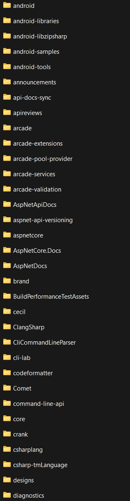

Orchestrate.ps1 isn't done yet. Some code was omitted.

- Downloads all public repositories of an organization.
- Converts all the code to txt documents

## TODO
Finish the code-to-txt converter.

## Example usage:

```
.\Orchestrate.ps1 dotnet
```

### Output
#### RepositoryListOutput.txt and /Repos folder
```
android-samples
cecil
BenchmarkDotNet
reactive
efcore
java-interop
aspnetcore
Open-XML-SDK
Scaffolding
Docker.DotNet
corefx
buildtools
core
orleans
AspNetCore.Docs
codeformatter
apireviews
fsharp
roslyn
corefxlab
dotnet.github.io
llilc
coreclr
dotnet-ci
ClangSharp
LLVMSharp
extensions
msbuild
runtime-assets
port-to-core
wcf
Nerdbank.GitVersioning
docs
EntityFramework.Docs
roslyn-analyzers
docfx
ef6
corert
corefx-tools
cli
Nerdbank.Streams
AspNetApiDocs
pinvoke
symreader
roslyn-analyzers-contrib
dotnet-docker
vscode-csharp
NuGet.BuildTasks
coreclr.xunit
import-comments
dotnet-docker-nightly
netcorecli-fsc
android
symreader-portable
macios-devtools
macios
project-system
versions
roslynator
jitutils
core-setup
training-tutorials
ResXResourceManager
fxdac
android-libzipsharp
android-tools
DataGridExtensions
templating
interactive-window
symstore
features
websdk
sdk
aspnet-api-versioning
WatsonWebserver
roslyn-tools
source-build
standard
ILMerge
xdt
sign
EntityFramework.ApiDocs
dotnet-docker-samples
source-indexer
SourceBrowser
linker
MVPSummitHackathon2016
WatsonTcp
portable-class-libraries
vblang
csharplang
csharp-tmLanguage
symreader-converter
windows-sdk-for-google-analytics
perf-infra
ProjFileTools
CliCommandLineParser
roslyn-sdk
new-repo
MQTTnet
announcements
Kerberos.NET
xliff-tasks
metadata-tools
platform-compat
dotnet-template-samples
cli-migrate
designs
docker-tools
roslyn-api-docs
corefx-standup
cli-deps-satellites
dotnet-cli-archiver
SyndicationFeedReaderWriter
project-system-tools
try
toolset
installer
Connect-Event-In-A-Box
orleans-templates
Microsoft.Data.Sqlite.ApiDocs
dotnet-api-docs
blazor
summer-of-code
dotnet-buildtools-prereqs-docker
samples
arcade
templates
performance
diagnostics
ml-api-docs
command-line-api
sourcelink
machinelearning
machinelearning-samples
JsApiDocs
BuildPerformanceTestAssets
test-templates
nuget-trends
jsinterop
orleans-docs
machinelearning-testdata
JavaApiDocs
infer
iot
TorchSharp
winforms
wpf
AspNetDocs
arcade-services
razor
arcade-extensions
arcade-validation
dotNext
winforms-datavisualization
format
windows-desktop
SqlClient
mbmlbook
msbuild-language-service
vscode-dotnet-runtime
source-build-reference-packages
arcade-pool-provider
spark
machinelearning-modelbuilder
cli-lab
Silk.NET
HttpRepl
try-samples
Comet
api-docs-sync
mcgutils
MobileBlazorBindings
nbgv
machinelearning-public-datasets
try-convert
runtime
windowsdesktop
org-policy
llvm-project
android-libraries
dotnet-console-games
interactive
tye
yarp
xharness
maui-samples
brand
crank
runtimelab
dotnet-operator-sdk
maui
install-scripts
insertions-client
issue-labeler
deployment-tools
icu
cssparser
apisof.net
docs-desktop
AzCopyNet
csharpstandard
xamarin
Microsoft.Maui.Graphics
iot-api-docs
website-thanks-data
ef6tools
datalab
Microsoft.Maui.Graphics.Controls
versionsweeper
upgrade-assistant
vscode-dotnet-pack
hotreload-utils
code-analysis
dotnet-monitor
emsdk
spa-templates
letslearndotnet
reproducible-builds
android-native-tools
wpf-test
docs-maui
msquic
docs-tools
actions-create-pull-request
perf-autofiling-issues
csharp-notebooks
TorchSharpExamples
razor-compiler
dotnet-maui-api-docs
blazor-samples
AspNetCore.Docs.Samples
source-build-externals
fabricbot-config
msbuild-api-docs
intro-to-dotnet-web-dev
systemweb-adapters
sdk-container-builds
dotnet-wasi-sdk
dev-proxy
dotnet
maintenance-packages
beginner-series
wasi-sdk
extensions-samples
emscripten
binaryen
node
cpython
dnceng-shared
dnceng
scenario-tests
workload-versions
aspire
android-api-docs
eShop
aspire-samples
docs-aspire
website-feedback
ai-samples
smartcomponents
homebrew-dev-proxy
eShopSupport
wix3
xcsync
wix
macios-samples
signalr-client-swift
lz4
aspire-devcontainer-nightly
aspire-devcontainer
aspire-devcontainer-feature
github-actions-issue-to-work-item
comment-pipeline
XAMLStudio
tutorial-codespace
```
#### Downloaded /Repos 




